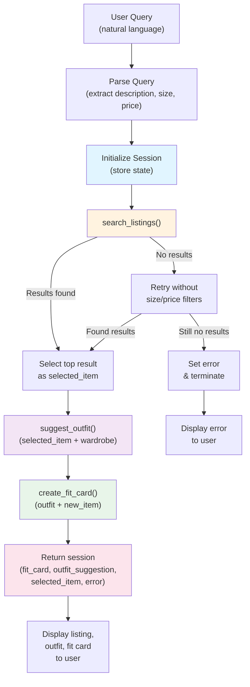

# FitFindr — planning.md

> Complete this document before writing any implementation code.
> Your spec and agent diagram are what you'll use to direct AI tools (Claude, Copilot, etc.) to generate your implementation — the more specific they are, the more useful the generated code will be.
> Your planning.md will be reviewed as part of your submission.
> Update it before starting any stretch features.

---

## A Complete Interaction

**User query:** "I'm looking for a vintage graphic tee under $30, size M. I mostly wear baggy jeans and chunky sneakers."

**What FitFindr does:**
FitFindr parses the natural language query to extract: `description="vintage graphic tee"`, `size="M"`, `max_price=30`. It then searches the listings dataset for matching items. If matches are found, it selects the top result and passes it to `suggest_outfit` along with the user's wardrobe to generate personalized styling advice. Finally, it calls `create_fit_card` to generate an Instagram-ready caption. If the search returns no results, it retries without size/price filters; if still empty, it tells the user and stops — it never calls tools with empty input.

**Data flow:**
1. Query → Parse → `search_listings("vintage graphic tee", size="M", max_price=30.0)` → Returns 3 results, top: `{id: "lst_006", title: "Graphic Tee — 2003 Tour Bootleg Style", price: 24.00, ...}`
2. Selected item → `suggest_outfit(new_item=lst_006, wardrobe=user_wardrobe)` → Returns: `"Pair this black graphic tee with your baggy dark jeans for a 90s grunge vibe. Throw on the black combat boots and your denim jacket for a complete look."`
3. Outfit suggestion → `create_fit_card(outfit=suggestion, new_item=lst_006)` → Returns: `"thrifted this vintage band tee for $24 and it's already my favorite. black on black with the wide-legs hits different 🖤"`

**Error handling:** If Step 1 returns empty, the agent informs the user ("No size M items under $30") and retries without filters. If still empty after retry, it sets `session["error"]` and terminates, never reaching Steps 2–3.

---

## Tools

List every tool your agent will use. For each tool, fill in all four fields.
You must have at least 3 tools. The three required tools are listed — add any additional tools below them.

### Tool 1: search_listings

**What it does:**
Searches the mock listings dataset (40 items) for secondhand clothing that matches the user's description, size, and price constraints. Returns the best-matching items ranked by relevance.

**Input parameters:**
- `description` (str): Keywords describing what to search for (e.g., "vintage graphic tee", "oversized blazer"). Required.
- `size` (str | None): Target size (XS, S, M, L, XL). Optional — if None, return all sizes.
- `max_price` (float | None): Maximum price in dollars. Optional — if None, return all prices.

**What it returns:**
A list of matching listing dictionaries, each containing: `id`, `title`, `description`, `category`, `style_tags`, `size`, `condition`, `price`, `colors`, `brand`, `platform`. Results should be ranked by relevance to the description query.

**What happens if it fails or returns nothing:**
If no results match the query, return an empty list. The agent will detect this and ask the user to loosen constraints (remove size/price filters) or try different keywords. The agent should inform the user that "no matches found for those criteria" and suggest retrying.

---

### Tool 2: suggest_outfit

**What it does:**
Given a new item and the user's existing wardrobe, suggests one or more complete outfit combinations. Uses an LLM to reason about style compatibility, color coordination, and occasion suitability.

**Input parameters:**
- `new_item` (dict): The listing dictionary of the item found by search_listings (contains title, colors, category, style_tags, etc.).
- `wardrobe` (dict): The user's wardrobe object (contains items array with existing pieces, each with category, colors, styles, etc.).

**What it returns:**
A string describing one or more outfit suggestions. Each suggestion should name the new item and specific pieces from the wardrobe that work with it, plus a brief reason why they pair well (e.g., "This vintage tee pairs well with your black denim and white sneakers — the neutral base lets the graphic tee stand out").

**What happens if it fails or returns nothing:**
If the wardrobe is empty or minimal (fewer than 2 items), the tool should acknowledge this and suggest minimal outfit pieces needed to make the new item work: "Your wardrobe is small, but this works great as a statement piece. Pair it with any neutral bottoms and sneakers." If color/style conflicts exist, still suggest the best option and note the reasoning.

---

### Tool 3: create_fit_card

**What it does:**
<!-- Describe what this tool does in 1–2 sentences -->
Generates a short, shareable Instagram-style caption for a complete outfit. The caption should sound natural and appealing — the kind of thing someone would actually post on social media, not a product description.

**Input parameters:**
- `outfit` (str): The outfit suggestion string from `suggest_outfit` (describes the items and why they work together).
- `new_item` (dict): The listing dictionary of the new item (for title, brand, style context).

**What it returns:**
A string (2–4 sentences) written as an Instagram caption. Should include style vibes, mood, or occasion, and sound authentic. Examples: "thrifted this graphic tee and it hits different with my black jeans 💚" or "cottagecore cardigan moment — pairing with basics for that quiet luxury aesthetic".

**What happens if it fails or returns nothing:**
If outfit data is missing or the LLM struggles to generate creative output, return a safe fallback caption: "[New item title] with [wardrobe piece category]. Complete the look." Always return *something* — the agent needs a fit_card to show the user, even if it's minimal.
---

### Additional Tools (if any)

<!-- Copy the block above for any tools beyond the required three -->

---

## Planning Loop

**How does your agent decide which tool to call next?**

The planning loop follows a sequential decision tree based on success/failure:

1. **Parse query** → Extract description, size, max_price from user input using LLM or simple string parsing.
2. **Call search_listings** with parsed parameters.
   - If results found: proceed to step 3.
   - If no results: Ask user to relax constraints (e.g., "No M-sized items under $30. Searching all sizes...") and retry without size/price filters.

A single `session` dictionary is the source of truth for the entire interaction:

```python
session = {
    "query": str,                # User's original input
    "parsed": {description, size, max_price},  # Extracted params
    "search_results": list,      # All results from search_listings
    "selected_item": dict,       # Top result from search (passed to suggest_outfit)
    "wardrobe": dict,            # User's wardrobe (passed to suggest_outfit)
    "outfit_suggestion": str,    # Output of suggest_outfit (passed to create_fit_card)
    "fit_card": str,             # Output of create_fit_card
    "error": str | None,         # Set if interaction ended early
}
```

Each tool reads what it needs from session and writes its result back:
- `search_listings(session["parsed"]["description"], ...)` writes to `session["search_results"]` and `session["selected_item"]`.
- `suggest_outfit(session["selected_item"], session["wardrobe"])` writes to `session["outfit_suggestion"]`.
- `create_fit_card(session["outfit_suggestion"], session["selected_item"])` writes to `session["fit_card"]`.

UI reads final session state and displays results.
4. **Call suggest_outfit** with selected_item and wardrobe.
   - Always returns *something* (may be "wardrobe is small" but never errors).
5. **Call create_fit_card** with outfit suggestion and new_item.
   - Always returns *something* (fallback caption if needed).
6. **Done** → Return session with all three results.

The agent doesn't skip steps — each call always happens once search succeeds. The loop terminates when all three tools have been called or when search fails twice (first normal, then loosened).

---

## State Management

**How does information from one tool get passed to the next?**
<!-- Describe how your agent stores and accesses state within a session. What data is tracked? How is it passed between tool calls? -->

---

## Error Handling

For each tool, describe the specific failure mode you're handling and what the agent does in response.

| Tool | Failure mode | Agent response |
|------|-------------|----------------|
| search_listings | No results match the query (empty list) | Return empty list to agent. Agent detects this, informs user ("No items found matching those criteria"), and retries without size/price filters. If still empty, set session["error"] to "No matching items found even with relaxed filters." and terminate. |
| suggest_outfit | Wardrobe is empty or minimal (< 2 items) | Tool detects this and returns a modified suggestion acknowledging the small wardrobe: "Your wardrobe is small, but this graphic tee works as a statement piece. Pair with basic bottoms and sneakers." Agent proceeds normally — this is *not* an error. |
| create_fit_card | Outfit input is missing or LLM fails to generate | Return a safe fallback caption: "[New item title] paired with wardrobe basics for a complete look." Always return a non-empty string so the agent can show *something* to the user. Never fail silently. |

---

## Architecture



**Flow summary:**
1. Parse user input into structured parameters.
2. Call search_listings; if empty, retry with relaxed filters.
3. If still no results, error out. Otherwise, continue.
4. Call suggest_outfit with the found item and user's wardrobe.
5. Call create_fit_card to generate shareable caption.
6. Return all results (or error) to UI.

---

## AI Tool Plan

### Tools Implementation (tools.py)

**AI tool:** GitHub Copilot  
**Input:** This planning.md (tool specs and error handling table)  
**Expected output:** Three complete, tested functions:
- `search_listings(description, size, max_price)` — uses semantic search or embeddings to match listings
- `suggest_outfit(new_item, wardrobe)` — uses Groq LLM to reason about style compatibility
- `create_fit_card(outfit, new_item)` — uses Groq LLM to generate Instagram-style caption

**Verification:** Test each tool independently in Python before wiring into agent:
```python
# Test search_listings
from tools import search_listings
results = search_listings("vintage graphic tee", size="M", max_price=30)
assert isinstance(results, list)
assert all(isinstance(item, dict) for item in results)  # returns dicts

# Test suggest_outfit
from tools import suggest_outfit
suggestion = suggest_outfit(results[0], wardrobe_dict)
assert isinstance(suggestion, str) and len(suggestion) > 0

# Test create_fit_card  
from tools import create_fit_card
card = create_fit_card(suggestion, results[0])
assert isinstance(card, str) and len(card) > 0 and card != suggestion
```

### Planning Loop Implementation (agent.py)

**AI tool:** GitHub Copilot  
**Input:** planning.md (Planning Loop, State Management, and Architecture sections)  
**Expected output:** `run_agent(query, wardrobe) → dict` function that:
- Initializes session dict
- Parses query (extracts description, size, max_price)
- Calls search_listings with fallback retry logic
- Calls suggest_outfit and create_fit_card in sequence
- Returns complete session dict

**Verification:** Call run_agent with test query and verify:
```python
from agent import run_agent
from utils.data_loader import get_example_wardrobe

result = run_agent("vintage tee under $30, size M", get_example_wardrobe())
assert result["fit_card"] is not None or result["error"] is not None
assert "selected_item" in result
```

### UI Implementation (app.py)

**AI tool:** GitHub Copilot  
**Input:** app.py skeleton and tools/agent specs  
**Expected output:** Completed `handle_query(user_query, wardrobe_choice)` that:
- Validates query is not empty
- Selects wardrobe based on user choice
- Calls run_agent
- Formats results for display (listing_text, outfit_suggestion, fit_card)

**Verification:** Run `python app.py` and test the Gradio UI with a few queries.

     "I'll use AI to help me code" is not a plan.
     "I'll give Claude my Tool 1 spec (inputs, return value, failure mode) and ask it to implement
     search_listings() using load_listings() from the data loader — then test it against 3 queries
     before trusting it" is a plan. -->

**Milestone 3 — Individual tool implementations:**

**Milestone 4 — Planning loop and state management:**

---

## A Complete Interaction (Step by Step)

Write out what a full user interaction looks like from start to finish — tool call by tool call. Use a specific example query.

**Example user query:** "I'm looking for a vintage graphic tee under $30. I mostly wear baggy jeans and chunky sneakers. What's out there and how would I style it?"

**Step 1:**
<!-- What does the agent do first? Which tool is called? With what input? -->

**Step 2:**
<!-- What happens next? What was returned from step 1? What tool is called now? -->

**Step 3:**
<!-- Continue until the full interaction is complete -->

**Final output to user:**
<!-- What does the user actually see at the end? -->
